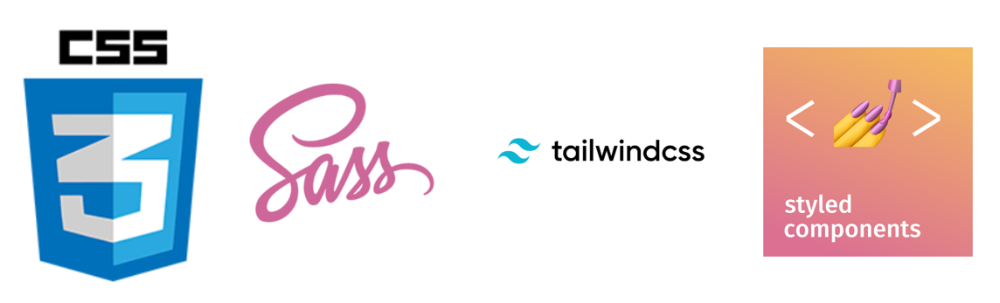

# P0 Portal 프로젝트 후기

안녕하세요.

현재는 아쉽게 잠정 연기된 프로젝트인 P0 프로젝트에 대해서 리뷰를 해보려고 합니다.

 

---

## Portal의 필요성

2022년 7월초부터 8월 말까지 2개월 정도 Portal 프로젝트를 진행했었습니다.

사내에 여러 서비스들이 존재하는데, 이들이 서로 독립적인 서비스였기 때문에 한 서비스를 사용하다가 다른 서비스로 넘어가려 하면 로그인을 새로 하여 들어가는 번거로움이 있었습니다.

Portal에서는 이러한 번거로움을 해결하고자 모든 서비스를 Portal에 모아두고 이 곳을 통해 각 서비스들이 유기적으로 연동되게 할 수 있도록 하는 것이 목표였습니다.

당시 리드 1명, 프론트엔드 1명, 백엔드 1명이서 개발을 진행하였으며, 저는 프론트엔드를 담당했습니다.

 

---

## 구현 목표

- ### 백엔드
    1.	portal에서 사용자 데이터베이스를 하나 생성해서 관리하고, 다른 서비스로 진입할 때 로그인 없이 들어갈 수 있게 할 것
    2.	만약 portal 페이지의 서버가 다운되면 각 서비스들이 기존처럼 독립되게 동작하게 할 것

- ### 프론트엔드
    1.	각 서비스들을 카드 컴포넌트로 표시(클릭 시 해당 서비스로 연결), 개수와 위치를 관리자가 바꿀 수 있게 할 것
    2.	모바일을 대비해서 반응형 레이아웃으로 할 것
    3.	추후에 추가될 대시보드 (날씨, 게시판 목록 미리보기 등) 대비할 것
    4.	관리자 페이지를 만들 것

 

프론트엔드는 UI/UX 및 모션, 사용성 부분에서 좀 더 모던하게 보일 수 있도록 ios의 화면 배치 방식을 참고해서 도전해보기로 했습니다.

 

---

## 언어, 프레임워크 및 도구 선택에 대한 고민과 결정

### 언어

프론트엔드 프레임워크로는 사내에서는 리액트를 사용해야 했기에 고민없이 선택했습니다.

`타입스크립트`는 새로 배워야된다는 점과 개발 속도가 살짝 늦어질 수 있다는 점을 제외하면 팀 프로젝트에서 도입하지 않을 이유가 없었습니다.

아래 예시에서 개발자의 의도는 숫자만 더해주는 함수 sum을 의도했지만, 자바스크립트에서는 문자열도 입력 받아 합친 문자열을 반환합니다. 반면 타입스크립트는 문자열을 입력 받으면 에러를 표시해 실수를 사전에 방지합니다.

(물론 자바스크립트도 타입을 체크하는 구문을 추가할 수 있지만 선택 사항이라 실수의 여지가 남을 수 있습니다.)

 

### 프레임워크

UX/UI 디자이너가 없어서, 처음에는 풍부한 컴포넌트를 가진 UI 프레임워크의 도움을 받으려 했습니다.

지원이 잘 되며 풍부한 컴포넌트를 가진 프레임워크를 알아보았는데, 크게 `Bootstrap`, `Material UI`, `Ant Design` 정도로 간추렸습니다.

Portal에 크게 필요했던 컴포넌트는 `카드`, `버튼`, `헤더`, `그리드` 등이 있었습니다. 시험삼아 각각의 프레임워크로 컴포넌트들을 사용해보았는데, 기존에 제가 구상했던 모양과 기능에서 많이 벗어나 생각보다 많은 수정이 필요했습니다.

UI 프레임워크의 필요성을 크게 느끼지 못해 우선 컴포넌트를 직접 만들어 사용하기로 결정하고, UI 프레임워크는 추후에 정말 필요한 경우 다시 사용해보기로 했습니다.

 

### CSS

`CSS`, `SCSS`, `styled-component`, `Tailwind-CSS` 중 하나를 선택하기로 했습니다.

`Tailwind-CSS`는 완성된 컴포넌트는 존재하지 않지만, CSS를 전혀 쓰지 않고도 디자인적 통일성이 높은 결과물을 빠른 속도로 개발할 수 있다는 장점이 존재합니다. 하지만 className이 너무 길어지면서 가독성에 문제가 생기고, 일회성 작업이 아닌 긴 유지보수가 필요한 프로젝트에서는 불리한 면이 많다고 생각하여 보류했습니다.

 

`styled-component`는 같은 파일에 css를 위치시키며 쉽게 컴포넌트화 시킬 수 있어 좋은 선택지이기는 했지만, 추후 CSS를 분리하고자 할때 작업이 매우 복잡해질 것 같아 보류하였습니다.

 

순수 CSS는 약간 아쉬운 부분이 존재하여 `SCSS`를 사용하기로 결정했습니다.

`SCSS`는 `중첩` 및 `반복분` 등을 사용할 수 있어 CSS 대비 간결하고 가독성 높은 코드를 작성할 수 있다는 장점이 있고, CSS 코드만으로 작성한다 해도 작동이 보장됩니다.

*CSS SCSS 중첩 비교*

 

*CSS SCSS 반복문 비교*
 

 

### 표기법

리액트에서는 한 컴포넌트에서 css를 불러오면 전역으로 적용되는 문제가 발생하여 초반에는 `BEM 표기법`을 이용해서 작성했습니다.

CSS의 규모가 커질수록 네이밍을 관리하는게 복잡해질 것 같다는 생각이 들었습니다.

그래서 `BEM 표기법` 대신 `CSS Module`을 사용해서 특정 컴포넌트에서만 스타일이 적용되게 하여 네이밍을 더 깔끔하게 정리할 수 있었습니다.

---

## 디렉토리 구조, 코딩컨벤션 설정 및 자동화

리액트에서 가장 기본적으로 쓰이는, 유지보수와 확장성이 용이한 구조로 디렉토리를 구성했습니다.

 
 
정적분석도구는 `eslint`, 코드 포매터는 `prettier`, 자동화 도구는 `husky`를 사용하여 통일된 코드 구성이 가능하도록 했습니다.

 

개발자가 커밋을 실행하게 되면 자동으로 husky가 (staged 파일에 한해) eslint 및 prettier 검사를 실행하고, 통과하지 못할 시 커밋이 거절되게 셋팅했습니다.

거절당하면 개발자가 수동으로 명령어를 입력하여 미리 설정된 규칙대로 수정되게 했습니다.

(개발자가 바뀐 코드는 검토하고 커밋되야 된다 생각해서 커밋 시 자동 수정되게 하지는 않았습니다.)

 

---

## 개발 과정 및 시행착오

### 레이아웃

우선 PC부터 모바일까지 대응하기 위해 `반응형 레이아웃`을 사용하였습니다.

 

### Drag and Drop

Drag and Drop 기능을 추가하기 위해서 react-dnd, beautiful-dnd 등 여러 유명한 dnd 라이브러리를 사용해서 적용을 해보았으나, 리액트와의 버전 문제 또는 그리드가 적용이 안되는 문제가 있었습니다.

오랜 삽질 끝에 `sortable.js` 라는 라이브러리의 리액트 버전을 찾아 적용하였고, 여기에 `Drop시 복귀 모션만 직접 추가`하여 사용했습니다.

 

### 카드 컴포넌트

카드 디자인은 검색을 통해 색 조합 등을 찾아보았지만 확실히 전문 분야가 아니다 보니 쉬운 작업은 아니었습니다.

고민 끝에 파스텔 톤 배경과 강조색을 활용해서 적절한 색 배합을 찾아내서 적용했습니다.

 

카드 컴포넌트는 관리자가 개발자 없이 카드 정보를 변경할 수 있도록, (프론트에서 값을 고정시켜 사용하는 것이 아닌) 백엔드에서 json을 받아와 화면에 표시해주는 방식입니다.

`제목`, `상세설명`, `아이콘`, `배경색`, `강조색`의 정보를 받아서 화면에 그려줍니다.

아이콘 이미지의 경우 `png` 파일로 `배경이 제거된 파일`이어야 하고, 해당 이미지의 `원본 색상에 상관없이 강조색으로 색 변환`을 진행합니다.

 

### 이슈

색 변환 작업에서 처음에는 아래 링크의 코드를 이용해 자바스크립트를 활용한 css filter 연산을 사용했습니다.

모션을 적용하다가 drop시 깜박거리는 이슈를 발견했는데, 원인은 찰나의 `색 변환 연산` 때문이었습니다.

해당 이슈는 `css-mask`로 변경 후 해결되었습니다.

 

*css-filter 적용시 깜박거리는 현상 발생 (https://stackoverflow.com/a/43960991/604861)*

 

*css-mask를 사용하고 나서는 모션이 부드럽게 연결됨*

 

### 랜덤 애니메이션

편집모드 시 보여지는 애니메이션을 적용했는데, `기울기`, `방향`, `상하좌우`, `속도`의 속성에 랜덤을 부여하여 서로 독립적으로 움직이는듯한 모션을 적용했습니다.

 

카드 컴포넌트의 개수가 json의 개수에 따라 동적으로 변하는데, scss에서는 동적으로 변하는 카드 컴포넌트의 개수를 정확히 파악할 수 없었고, 애니메이션의 개수를 미리 상수값으로 지정해주는 방식을 사용해야 했습니다.

적은 값을 주면 애니메이션이 서로 중복이 되고, 많은 값을 주기에는 카드 컴포넌트가 얼마나 추가될지 알기 어려웠습니다.

그래서 css의 `nth-child`를 이용해서 해당 `배수`에 대해서 애니메이션이 `적용`되도록 했습니다.

 

 
(1,2,3,4,5,6,7,8,9,10)의 최소공배수 -> 2,520번 마다 애니메이션 패턴이 반복되게 됩니다.

 

좀 더 효율적으로 하기 위해 소수를 이용했습니다.

 
(1,2,3,5,7,11,13,17,19,23)의 최소공배수 -> 223,092,870번 마다 애니메이션 패턴이 반복되게 됩니다.

 

---

## 결과물

편집 버튼을 누르게 되면 각 카드들이 편집모션으로 전환되고, 자유롭게 사용자가 재배치 할 수 있습니다. 재배치가 끝나고 버튼을 눌러 위치를 확정할 수 있습니다.

 

---

### 미완성

삭제 기능은 구현했지만, 삭제 모션은 진행중입니다.

카드 컴포넌트 4개 크기로, 다양한 정보를 담을 수 있는 위젯 컴포넌트도 진행중에 있습니다.

 

---

#### 사진 출처

- https://poiemaweb.com/typescript-introduction
- https://oak.is/thinking/accessible-drag-and-drop/
- https://medium.com/@yusufmirza55/whats-the-difference-between-scss-and-css-and-why-we-should-use-scss-589c99e509d
- https://www.google.com/url?sa=i&url=https%3A%2F%2Fwww.reddit.com%2Fr%2Fneovim%2Fcomments%2Fonay9n%2Fhelp_with_neovim_formatting_for_web_development%2F&psig=AOvVaw39t8Ple_vSudpdRlTkuff_&ust=1669338313905000&source=images&cd=vfe&ved=0CA0QjRxqFwoTCICHzcfRxfsCFQAAAAAdAAAAABAD
- https://www.slideshare.net/robdvr/sass-compass-40996352
